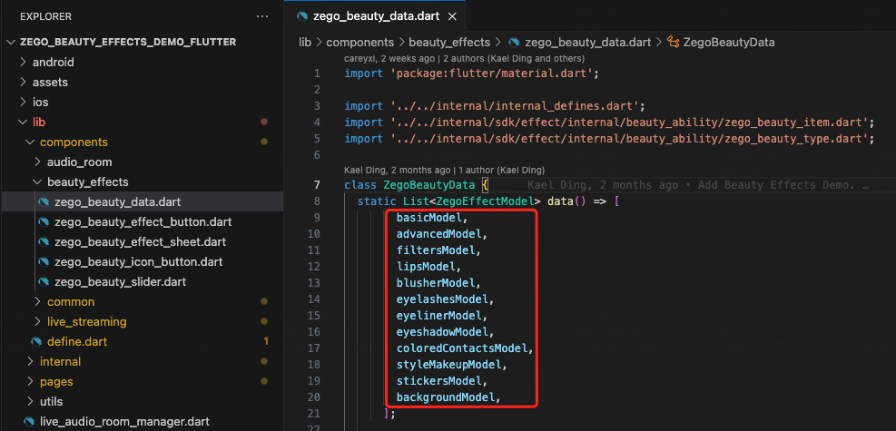

# Prerequisites

Before you begin, make sure you complete the following:

* **Contact ZEGOCLOUD Technical Support to activate the advanced beauty effects**.


## Disclaimer and Risks of Demo Code Usage

Dear user,

Before you proceed with this code, we urge you to read the following disclaimer thoroughly. This code is purely for reference and learning. Please be aware that any risks arising from the use of this code lie solely with the user. The author will not be held accountable for any loss or risk incurred.

The potential security risks include:
- The code may contain vulnerabilities or errors.
- System malfunctions or data loss might occur.
- The code may depend on third-party libraries or services.
- Some portions of the code should be used for teaching and demonstration only.

Users should:
- Be prepared for the security risks and take necessary measures to safeguard their systems and data.
- Backup data to avoid potential data loss.
- Evaluate the security and reliability of any third-party dependencies.
- Handle sample or demonstration code with caution, not using them in production environments.

Please ensure you fully comprehend and accept all risks and disclaimers before using this code. The author will not be accountable for any issues that arise from the use of this code. If you disagree with any part of this disclaimer, please refrain from using the code.


# How to integrate it into your own project

---- 

# 1 The code structure of the Demo is as follows.

Before we start, let me introduce the structure of the demo.

```bash
lib
├── components
├── internal
├── utils
├── zego_sdk_manager.dart
├── live_audio_room_manager.dart
├── zego_live_streaming_manager.dart
├── zego_call_manager.dart
├── zego_sdk_key_center.dart
├── main.dart
└── pages
    ├── login_page.dart
    ├── home_page.dart
    ├── audio_room
    ├── call
    └── live_streaming
```

- zego_sdk_key_center.dart - You need to fill in your appid and appsign to this file. (serverSecret can be filled in arbitrarily if you don't need Flutter web).
- `components` - UI components used in the demo.
- `utils` - App permission management, token generation, and other logic
- `internal` - Best practice encapsulation of ZEGOCLOUD SDK, try not to modify the code here (if there are bug fixes in the demo, we will update it here, and you should strive to keep the code here consistent with our demo to facilitate easier updates).
- `zego_sdk_manager.dart` - You need to initialize the SDK using the init method and call the connectUser method to connect the user when they login. ( Please refer to login_page.dart for specific usage instructions.)
- `zego_live_streaming_manager.dart` - ZEGOCLOUD implements live streaming scenes, including methods such as joining and leaving rooms, co-hosting, PK, etc. Please refer to `pages/live_streaming` for specific usage instructions.
- `live_audio_room_manager.dart`- ZEGOCLOUD implements the scene of a live audio room (voice chat room), including methods such as joining and leaving the room, taking and leaving the seat, locking the seats, and switching seats, etc. Please refer to pages/audio_room for specific usage methods.
- `zego_call_manager.dart`- ZEGOCLOUD implements the scene of a video/audio call, including methods such as joining and leaving the call, switch camera, enable speaker, etc. Please refer to pages/call for specific usage methods.
- `login_page.dart` and `home_page.dart` - You can refer to these two files to see how to initialize the SDK and how to navigate to the live page and chat room page.

# 2 Integration guide
## 2.1 Copy Dart files into your project

- You need to copy the red part files to your project
- And the blue part is optional:
  - If you need live streaming, you will need `pages/live_streaming` and  `zego_live_streaming_manager.dart`
  - If you need live audio room, you will need `pages/audio_room` and  `live_audio_room_manager.dart`
  - If you need call, you will need `pages/call` and  `zego_call_manager.dart`


## 2.2 Copy assets to your project

- Copy assets into your project and declare them in the `pubspec.yaml` file. (Due to the usage of some assets in the demo, such as button icons)


## 2.3 Add beauty effects resources

Advanced beauty effects require corresponding beauty resources to be effective.

### 2.3.1 Download beauty resources

Click to download the [beauty resources](https://storage.zego.im/sdk-doc/Pics/zegocloud/uikit/BeautyResources.zip), and extract the resources to your local folder.


### 2.3.2 Add beauty resources to iOS project

1. Open your project with Xcode.

2. Drag the downloaded `BeautyResources` folder to the directory, and select `Create folder references`.

   

### 2.3.3 Add beauty resources to Android project

1. Create an assets folder under the `main` directory of your Android project (no need to create one if the assets folder already exists), like this:
    **xxx/android/app/src/main/assets**

2. Copy the downloaded `BeautyResources` folder to the assets directory.


## 2.4 Use them in your code

### 2.4.1 init sdk and connect user

You need to initialize the SDK using the `init` method and call the `connectUser` method to connect the user when they login. ( Please refer to `login_page.dart` for specific usage instructions.)

You can put this logic in your user's login button, or call these two methods when the user successfully logs in through cache. For example:

```dart
ElevatedButton(
  onPressed: () async {
    await ZEGOSDKManager.instance.init(SDKKeyCenter.appID, kIsWeb ? null : SDKKeyCenter.appSign);
    await ZEGOSDKManager.instance.connectUser(userIDController.text, userNameController.text);
  },
  child: const Text('Login'),
),
```

Tips: You can use the `ZEGOSDKManager` to listen to the underlying events of the Basic SDK and obtain the user connection state. Below is an example code for navigating to the home page when the user successfully connects. ( Please refer to `login_page.dart`. )

```dart
ZEGOSDKManager.instance.zimService.connectionStateStreamCtrl.stream.listen((ZIMServiceConnectionStateChangedEvent event) {
  debugPrint('connectionStateStreamCtrl: $event');
  if (event.state == ZIMConnectionState.connected) {
    Navigator.pushReplacement(
      context,
      MaterialPageRoute(builder: (context) => const HomePage()),
    );
  }
});
```

### 2.4.2 Navigate to the live_page

After ensuring successful user login, you can freely use `ZegoLivePage` at any time.

```dart
  Widget hostJoinLivePageButton() {
    return SizedBox(
      width: 200,
      height: 50,
      child: ElevatedButton(
        onPressed: () {
          Navigator.push(
            context,
            MaterialPageRoute(
              builder: (context) => ZegoLivePage(roomID: roomIDController.text, role: ZegoLiveRole.host),
            ),
          );
        },
        child: const Text('Start a Live Streaming'),
      ),
    );
  }
```


## 2.5 How to delete unnecessary beauty features

Advanced beauty currently supports a total of 12 types of features, including: basic beauty, facial shaping, filters, lipstick, blush, eyeliner, eyeshadow, colored contacts, style makeup, stickers, and background segmentation.


If you don't need a certain feature, you can comment out the corresponding item in the `zego_beauty_data.dart` file.


#### Delete beauty resources

After you comment out the unnecessary beauty features, you also need to delete the unused beauty resources.

##### Basic

Do not need to delete resources.

##### Advanced

Do not need to delete resources.

##### Filters

If you don't need this feature, you can delete the following resources.

```
/BeautyResources/AdvancedResources/filterDreamyCozily.bundle
/BeautyResources/AdvancedResources/filterDreamySunset.bundle
/BeautyResources/AdvancedResources/filterDreamySweet.bundle
/BeautyResources/AdvancedResources/filterGrayFilmlike.bundle
/BeautyResources/AdvancedResources/filterGrayMonet.bundle
/BeautyResources/AdvancedResources/filterGrayNight.bundle
/BeautyResources/AdvancedResources/filterNaturalAutumn.bundle
/BeautyResources/AdvancedResources/filterNaturalBrighten.bundle
/BeautyResources/AdvancedResources/filterNaturalCreamy.bundle
/BeautyResources/AdvancedResources/filterNaturalFresh.bundle
```

##### Lipstick

If you don't need this feature, you can delete the following resources.

```
/BeautyResources/AdvancedResources/beautyMakeupLipstickCameoPink.bundle
/BeautyResources/AdvancedResources/beautyMakeupLipstickCoral.bundle
/BeautyResources/AdvancedResources/beautyMakeupLipstickRedVelvet.bundle
/BeautyResources/AdvancedResources/beautyMakeupLipstickRustRed.bundle
/BeautyResources/AdvancedResources/beautyMakeupLipstickSweetOrange.bundle
```

##### Blusher

If you don't need this feature, you can delete the following resources.

```
/BeautyResources/AdvancedResources/beautyMakeupBlusherAprocitPink.bundle
/BeautyResources/AdvancedResources/beautyMakeupBlusherMilkyOrange.bundle
/BeautyResources/AdvancedResources/beautyMakeupBlusherPeach.bundle
/BeautyResources/AdvancedResources/beautyMakeupBlusherSlightlyDrunk.bundle
/BeautyResources/AdvancedResources/beautyMakeupBlusherSweetOrange.bundle
```

##### Eyelashes

If you don't need this feature, you can delete the following resources.

```
/BeautyResources/AdvancedResources/beautyMakeupEyelashesCurl.bundle
/BeautyResources/AdvancedResources/beautyMakeupEyelashesEverlong.bundle
/BeautyResources/AdvancedResources/beautyMakeupEyelashesNatural.bundle
/BeautyResources/AdvancedResources/beautyMakeupEyelashesTender.bundle
/BeautyResources/AdvancedResources/beautyMakeupEyelashesThick.bundle
```

##### Eyeliner

If you don't need this feature, you can delete the following resources.

```
/BeautyResources/AdvancedResources/beautyMakeupEyelinerCatEye.bundle
/BeautyResources/AdvancedResources/beautyMakeupEyelinerDignified.bundle
/BeautyResources/AdvancedResources/beautyMakeupEyelinerInnocent.bundle
/BeautyResources/AdvancedResources/beautyMakeupEyelinerNatural.bundle
/BeautyResources/AdvancedResources/beautyMakeupEyelinerNaughty.bundle
```

##### Eyeshadow

If you don't need this feature, you can delete the following resources.

```
/BeautyResources/AdvancedResources/beautyMakeupEyeshadowBrightOrange.bundle
/BeautyResources/AdvancedResources/beautyMakeupEyeshadowMochaBrown.bundle
/BeautyResources/AdvancedResources/beautyMakeupEyeshadowPinkMist.bundle
/BeautyResources/AdvancedResources/beautyMakeupEyeshadowShimmerPink.bundle
/BeautyResources/AdvancedResources/beautyMakeupEyeshadowTeaBrown.bundle
```

##### Colored Contacts

If you don't need this feature, you can delete the following resources.

```
/BeautyResources/AdvancedResources/beautyMakeupColoredContactsBrownGreen.bundle
/BeautyResources/AdvancedResources/beautyMakeupColoredContactsChocolateBrown.bundle
/BeautyResources/AdvancedResources/beautyMakeupColoredContactsDarknightBlack.bundle
/BeautyResources/AdvancedResources/beautyMakeupColoredContactsLightsBrown.bundle
/BeautyResources/AdvancedResources/beautyMakeupColoredContactsStarryBlue.bundle
```

##### StyleMakeup

If you don't need this feature, you can delete the following resources.

```
/BeautyResources/AdvancedResources/beautyStyleMakeupCutieCool.bundle
/BeautyResources/AdvancedResources/beautyStyleMakeupFlawless.bundle
/BeautyResources/AdvancedResources/beautyStyleMakeupInnocentEyes.bundle
/BeautyResources/AdvancedResources/beautyStyleMakeupMilkyEyes.bundle
/BeautyResources/AdvancedResources/beautyStyleMakeupPureSexy.bundle
```

##### Stickers

If you don't need this feature, you can delete the following resources.

```
/BeautyResources/StickerBaseResources.bundle
/BeautyResources/AdvancedResources/stickerAnimal.bundle
/BeautyResources/AdvancedResources/stickerCat.bundle
/BeautyResources/AdvancedResources/stickerClawMachine.bundle
/BeautyResources/AdvancedResources/stickerClown.bundle
/BeautyResources/AdvancedResources/stickerCoolGirl.bundle
/BeautyResources/AdvancedResources/stickerDeer.bundle
/BeautyResources/AdvancedResources/stickerDive.bundle
/BeautyResources/AdvancedResources/stickerSailorMoon.bundle
/BeautyResources/AdvancedResources/stickerWatermelon.bundle
```

##### Background segmentation

If you don't need this feature, you can delete the following resources.

```
/BeautyResources/BackgroundSegmentation.model
/BeautyResources/BackgroundImages/
```


